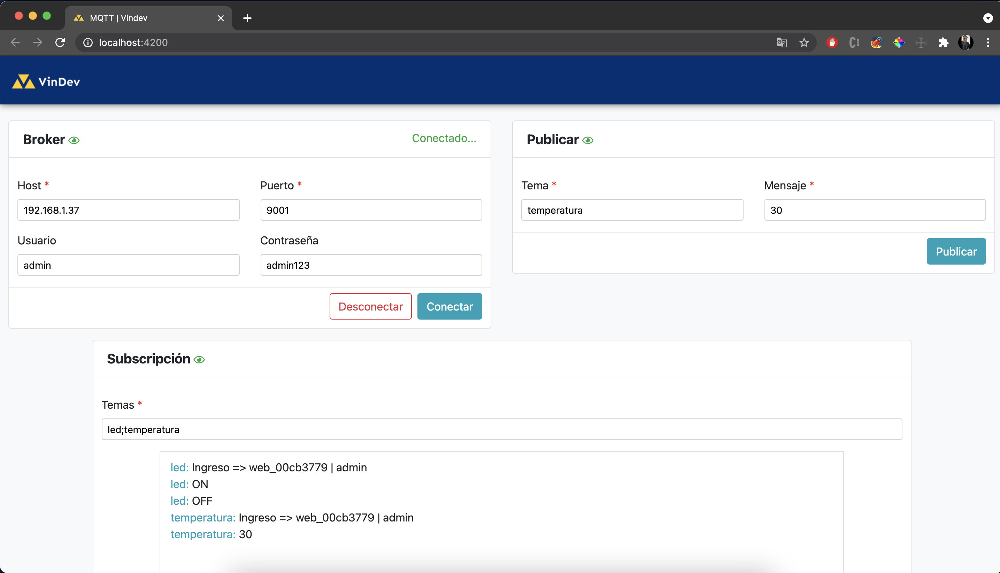

# Web Test Servidor MQTT (IoT) | PubSub

Aplicación web para probar servidor (Broker) MQTT.

## Angular Cli Version

Este proyecto es generado con Angular Cli version 11.0.7.

## Instalar dependencias

Ejecutar en consola `npm install`

## Iniciar aplicación

Ejecutar en consola `ng serve -o` y en su explorador navegar a `http://localhost:4200/`

